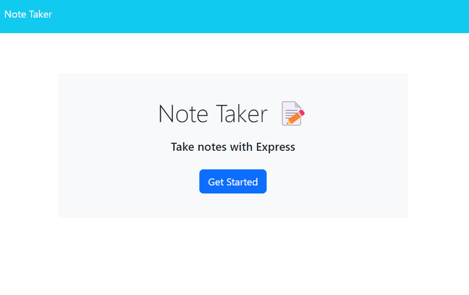
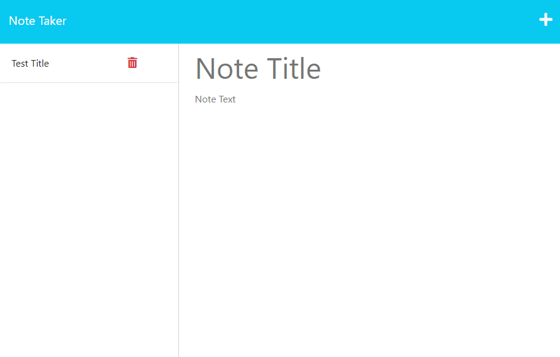
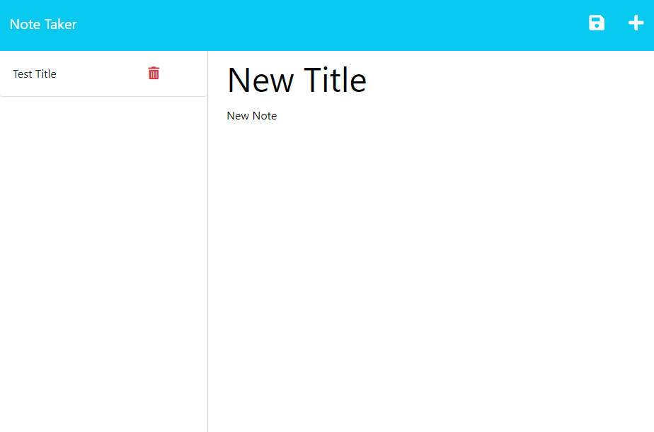

# Note-Taker

## Description

This web app lets you take, save and delete notes for everyday use. This app helped me understand express and I have a better understanding of servers.

## Table of Contents

- [Installation](#installation)
- [Usage](#usage)
- [License](#license)

## Installation

N/A

## Usage

### Link to site: https://note-taker11723-7095b105c508.herokuapp.com/

### This is the home page, press the get started button to begin.
 

### You are now able to take notes write down your note title and note text. 
 

### Once you completed filling out the text a floppy disk icon will apear on the top-right of the page, press it to save your note. Your notes will save on the left side of the screen, you may also delete them by pressing the trash icon.

## License

Please refer to the LICENSE in the repo.

## Badges

